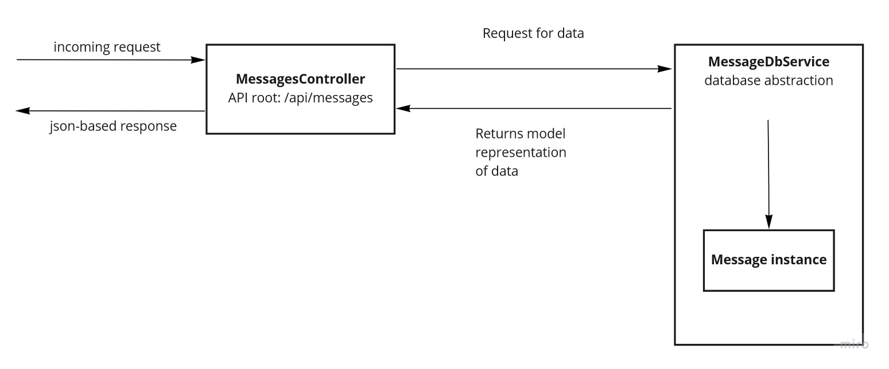

# CloudAuditionApi

CloudAuditionApi is the backend component for the CloudAudition project.

## Usage

The API components is shipped as a Docker image, which can be found [here](https://cloud.docker.com/u/renehr9102/repository/docker/renehr9102/cloud_audition_api).

### Download

```powershell
> docker pull renehr9102/cloud_audition_api:0.1.0
```

The API backend connects to a Postgres database for storing the messages received. The project provides a [docker-compose](docker-compose.yml) file which can be use as starting point to get up and running with the complete API component

In the directory where the docker-compose file is located run:

```powershell
> docker-compose build

> docker-compose up
```

## Design consideration

The following section includes a high level analysis of the main aspects of the design of the API system.

### Architecture

Below, it a diagram representation of the architecture of API layers and their interactions:



### REST API definition

The REST API is defined as follows:

* `GET /api/messages`: Returns a list of all the messages currently stored in the database
* `GET /api/messages/{id}`: Returns a single message object with the given id
* `POST /api/messages`: Receives in the request body the content of a new message
* `PUT /api/messages/{id}`: Receives the id of the message to update plus the content change in the request body
* `DELETE /api/messages/{id}`: Receives the id of the message to delete from the system

### OpenAPI and documentation

The API component implements the OpenAPI specification through the Swagger tooling integrated within the .NetCore application. This facilitates documentation of the API as well the enablement of auto-discovery capabilities of the endpoints for consumers.

**Endpoint**: /swagger/index.html

### Palindrome detection

As part of the API functionality, it needs to provide information whether certain message is a palindrome.

To start, let's clarify some details about palindrome:

* Standard definition: is a word, number, phrase, or other sequence of characters which reads the same backward as forward, such as madam or racecar or the number 10801. We will assume here that case is also taken into account for characters to match. Examples of this can be:
    * madam
    * racecar
    * No lemon,nomel oN
* Palindromes with allowances: Adjustments for the character-matching process are made, such as being case-insensitive, discard punctuation and word dividers. Examples of this can be:
    * A man, a plan, a canal, Panama!
    * No 'x' in Nixon

#### Simple palindrome

The simple palindrome refers to the implementation of the *Standard definition* as part of the component, found at [SimplePalindromeEvaluator](CloudAuditionApi/Palindrome/SimplePalindromeEvaluator.cs)
